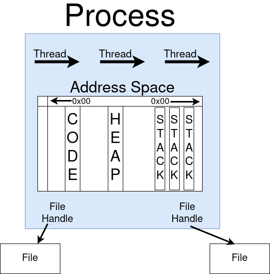
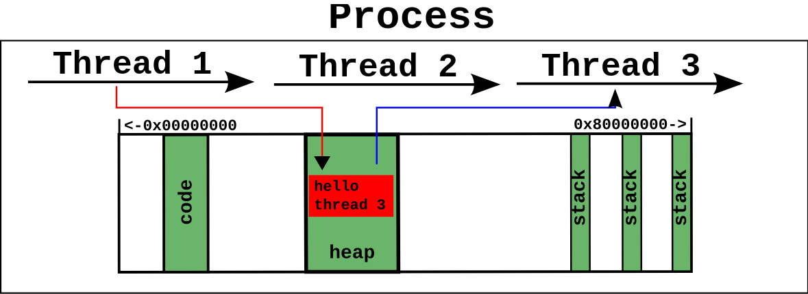
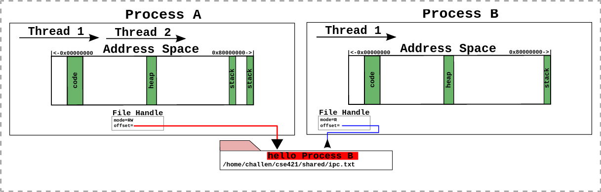

= Class 1

By this time, I've configured the `os161` on `vagrant`

== OS (Operating System) Abstractions
- Make Applications easier to build
- Hiding undesireable properties mostly of interactions with Hardware
- Organizing Information
- Provides `Interface` to Apps Programmers that seperates `Policy`. What the interface commits to accoplishing form
`Mechanism` -> How the Interace is Implemented, An Interface is what allows you to communicate between 2 components
like Hardware or Systemcalls etc.
=== Example : file
*Undesireable Properties of a File: *
- On the Disk, it starts from 0 Byte to it's file length.
- Disk Storage may Fail like Flash Drives.
- Chunks of the file are spread all over the disk.
- Disk can sometimes be Slow.
- File Systems come in to Optimize the Disk and make it more Robust.
- Permissions & Encryption and Access of a Specific user and iAM.
- Growth & Shrinking of Files.
- Organizing data into Direcotries.

=== Abstractions: 

- *Thread* is fundamentally an Abstraction for CPU
- *Address Spaces* are for RAM(Random Access Memory)
- *File* is for Disk

=== Processes
Processes are an essential key to Operating Systems, In linux it's *Tasks*, It's one of the most of the most fundamental
abstractions. Processes can contain more than one theread, an Address Space & zero or more file handles representing files

Applications that you're using are also Processes.

Processes are not tied to be limited to Hardware Components.

*Processes as Protection Boundary* : Processes are also used to set boundaries for one process to access an element
of another process. An OS isolates one process from Each other, Inside a Process you can pretty much do anything.

==== Intraprocess Communications

*Easy Representation*: 

Communications are performed by Shared memory.

In a Multi Threaded Program, Thread Stacks, Thread local variable are private. Syncronization is necessary to keep the data consistent.
Data can only be shared by the Consent of the Both Processes.

One Process can't send *SIGKILL* to other processes.

Wait with IPC : 
[source,bash]
----
$ sleep 5 && /bin/true &
----
this would generate a process id at the end.
[source,bash]
----
$ wait [process_id]
----
`echo $?` to get the return code of the last process. `/bin/true` -> returns 0.

*| <- Pipes :*
[source,bash]
----
$ ps aux | grep challen
----
While using pipes |, the OUTPUT of the first statement serves as the INPUT to the statement. If there are more than
3-4 statments, try to utilize something else, Some Sysadmins write 10 ot 12 commands in the same line.

=== Signals
[source,bash]
----
$ kill ps_id
----
Can also be used by `CTRL+C`, It sends the `SIGTERM` signal which requests the process to kindly close.

Another signal is `SIGKILL`, It send You will *DIE* (It can obly be sent to processes you own.) 
